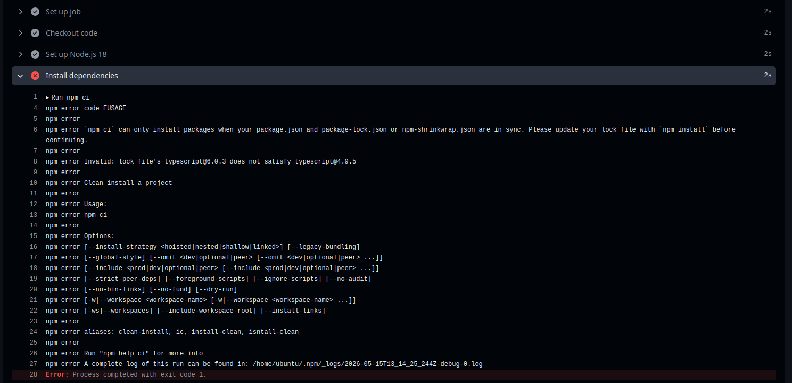
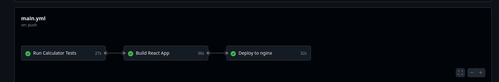

<h2>CI and CD</h2>
CI (Continuous Integration) means every time a developer pushes code, it is automatically tested and built. This catches bugs immediately before they reach other developers.
CD (Continuous Deployment) means after tests pass, the code is automatically deployed to the server without any human involvement. The user sees the new change instantly after every successful push.

<h2>Workflow execution process</h2>
*This is calculator app.Three job here,CI(Run Calculator Tests,Build React App) and CD(Deploy to nginx).I crated ci.yml file where i said workflow of pipeline.First test the app and check whether any existing funxtionality break by new modification.If pass,then build the and then deploy to public ec2 server.
 
*To identify git repo from ec2 ,i configured in ec2 server by which the code given form github.

<h2>Error Debug</h2>

i used run: npm cli instead of npm install and got this error as package.json and package.lock.json don't match for typescript

<h2>Suceessful Deployment</h2>
